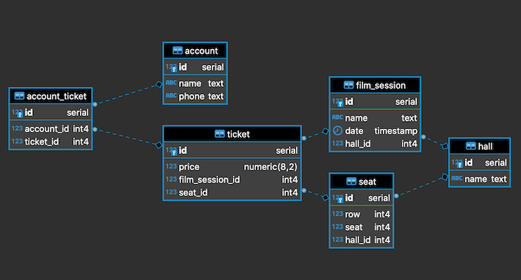
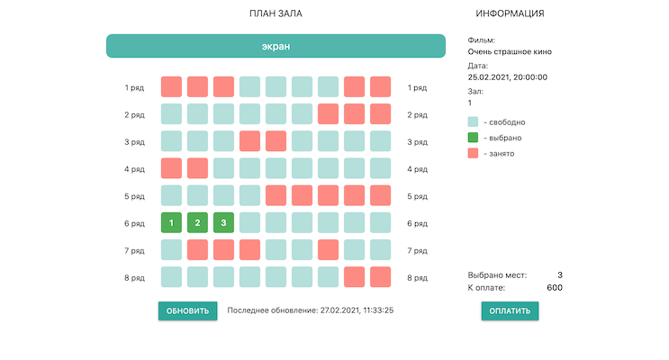
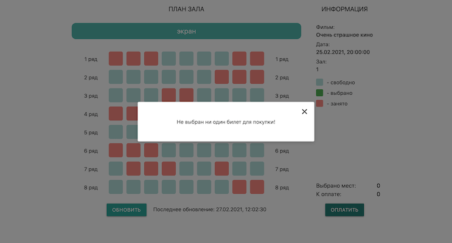
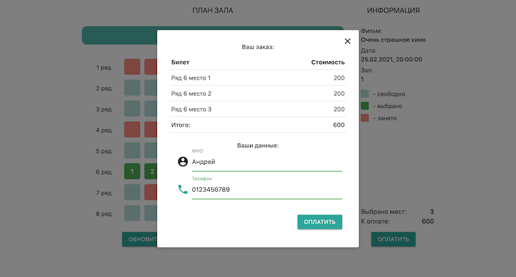
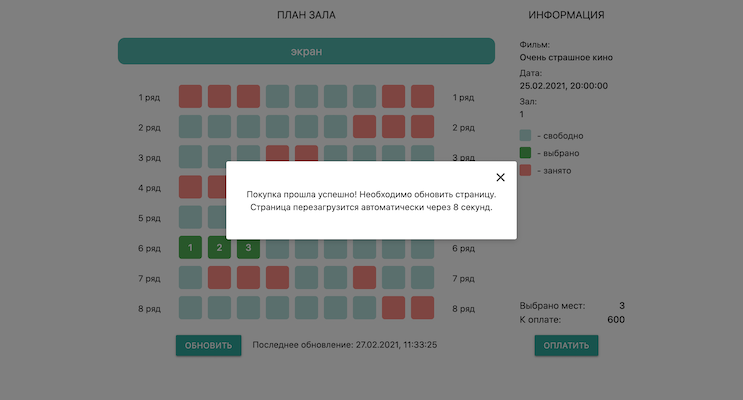

# Cinema
[](https://travis-ci.org/ReyBos/job4j_cinema) &nbsp;&nbsp;
[](https://codecov.io/gh/ReyBos/job4j_cinema)

<a name="menu"></a>
<ul>
    <li>
        <a href="#about">О проекте</a>
        <ul>
            <li><a href="#description">Описание</a></li>
            <li><a href="#technologies">Технологии</a></li>
            <li><a href="#structure">Структура</a></li>
            <li><a href="#scheme">Схема БД</a></li>
        </ul>
    </li>
    <li>
        <a href="#build">Сборка</a>
    </li>
    <li>
        <a href="#usage">Использование</a>
        <ul>
            <li><a href="#hall">Схема зала</a></li>
            <li><a href="#validate">Валидация данных</a></li>
            <li><a href="#order">Покупка билетов</a></li>
        </ul>
    </li>
    <li>
        <a href="#contact">Контакты</a>
    </li>
</ul>

<h2><a name="about">О проекте</a>&nbsp;&nbsp;<a href="#menu">&#9650;</a></h2>
<h4><a name="description">Описание</a>&nbsp;&nbsp;<a href="#menu">&#9650;</a></h4>
<p>
    Проект для изучения Java EE.
</p>
<p>
    Это приложение - часть сервиса по онлайн бронированию билетов в кинотеатр.<br>
    Посетителю предоставляется возможность выбрать места в зале кинотеатра и оплатить их. Также есть возможность обновлять схему зала для получения
    клиентом актуальной информации о доступных к покупке местах. Реализован функционал по регистрации пользователей на основе введеных данных о покупателе.
    
</p>

<h4><a name="technologies">Технологии</a>&nbsp;&nbsp;<a href="#menu">&#9650;</a></h4>
<ul>
    <li>Java 14</li>
    <li>Java EE Servlets</li>
    <li>PostgreSQL, JDBC, Liquibase</li>
    <li>JUnit</li>
    <li>Maven, Tomcat</li>
    <li>HTML, JavaScript, jQuery, JSON</li>
    <li><a href="https://materializecss.com">Material Design library</a></li>
</ul>

<h4><a name="structure">Структура</a>&nbsp;&nbsp;<a href="#menu">&#9650;</a></h4>
<pre><code>.
|-db
|---scripts
|-images
|-src
|---main
|-----java/ru/job4j/cinema
|-------------model
|-------------service
|-------------servlet
|-------------store
|-----resources
|-----webapp
|-------WEB-INF
|-------css
|-------js
|---test
|-----java/ru/job4j/cinema
└-------------store
</code></pre>

<h4><a name="scheme">Схема БД</a>&nbsp;&nbsp;<a href="#menu">&#9650;</a></h4>
<p align="center">
  
</p>

<h2><a name="build">Сборка</a>&nbsp;&nbsp;<a href="#menu">&#9650;</a></h2>
<ol>
    <li>
        Для успешной сборки и работы проекта на вашем компьютере должны быть установлены:
        <ol>
            <li>JDK 14(+)</li>
            <li>Maven</li>
            <li>PostgreSQL</li>
            <li>Tomcat</li>
        </ol>
    </li>
    <li>
        В PostgreSQL создайте базу с именем "job4j_cinema"
    </li>
    <li>
        Скачайте проект к себе на компьютер с помощью команды<br>
        <code>git clone https://github.com/ReyBos/job4j_cinema.git</code><br>
        перейдите в корень проекта
    </li>
    <li>
        Добавьте настройки для доступа к базе данных, для этого внесите соответствующие изменения в файле 
        <code>src/main/resources/db.properties</code><br>
        и в файле конфигурации проекта <code>pom.xml</code>
    
``` 
<profile>   
    <id>production</id>
    <properties>
        <db.url>jdbc:postgresql://127.0.0.1:5432/job4j_cinema</db.url>
        <db.username>postgres</db.username>
        <db.password>password</db.password>
        <db.driver>org.postgresql.Driver</db.driver>
    </properties>
</profile>
```
</li>
    <li>
        Выполните команду <code>mvn install -Pproduction</code> в корне проекта для его сборки<br>
        Будет выполнена миграция БД с помощью Liquibase.<br>
        В случае успешной сборки появится файл <code>target/job4j_cinema-&#60;version&#62;.war</code><br>
        переименуйте его в <code>cinema.war</code>
    </li>
    <li>
        Для запуска веб-приложения вам нужно скопировать <code>cinema.war</code> в папку <code>webapps</code> вашего Tomcat
    </li>
    <li>
        После запуска сервера приложение будет доступно по адресу<br>
        <a href="http://localhost:8080/cinema/">http://localhost:8080/cinema/</a>
    </li>
</ol>

<h2><a name="usage">Использование</a>&nbsp;&nbsp;<a href="#menu">&#9650;</a></h2>
<h3><a name="hall">Схема зала</a>&nbsp;&nbsp;<a href="#menu">&#9650;</a></h3>
<p>
    При заходе на страницу ассинхроно с сервера загружаются данные о текущем киносеансе. На странице отображается
    схема зала с указанием занятых и доступных к покупке мест и общая информация о сеансе. При выборе интересующих мест
    отображается общая информация о стоимости покупки.
</p>
<p align="center">
  
</p>
<h3><a name="validate">Валидация данных</a>&nbsp;&nbsp;<a href="#menu">&#9650;</a></h3>
<p>
    В приложении на стороне клиента и сервера организована валидация данных. Клиент не может перейти к покупке 
    пока не будет выбран хотя бы один билет и не будут введены все данные о покупателе в форме оплаты. На сервере
    валидация происходит за счет созданной схемы БД, при которой невозможно зарегистрировать двух пользователей
    с одинаковым телефоном и невозможно купить два билета с одинаковым идентификатором. 
</p>
<p align="center">
  
</p>
<h3><a name="order">Покупка билетов</a>&nbsp;&nbsp;<a href="#menu">&#9650;</a></h3>
<p>
    После того как пользователь нажал кнопку "оплатить", открывается форма оплаты. В форме подробно описан
    заказ и его итоговая стоимость, также предлагается ввести данные покупателя для совершения операции.
</p>
<p align="center">
  
</p>
<p>
    После заполнения формы, данные отправляются на сервер, результат обработки покупки будет выведен пользователю в том же окне. 
    После чего, спустя некоторое время, страница будет перезагружена для актуализации информации о доступных билетах
</p>
<p align="center">
  
</p>

<h2><a name="contact">Контакты</a>&nbsp;&nbsp;<a href="#menu">&#9650;</a></h2>
<p>Связаться со мной по всем интересующим вопросам вы можете здесь:</p>

[](https://www.linkedin.com/in/reybos/)&nbsp;&nbsp;
[](https://vk.com/reybos)&nbsp;&nbsp;
[](https://www.instagram.com/andreybossiy)&nbsp;&nbsp;
[](https://t.me/reybos)&nbsp;&nbsp;
[](mailto:andreybosiy@yandex.ru)&nbsp;&nbsp;
